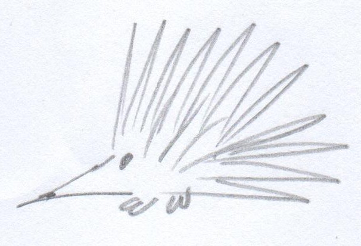
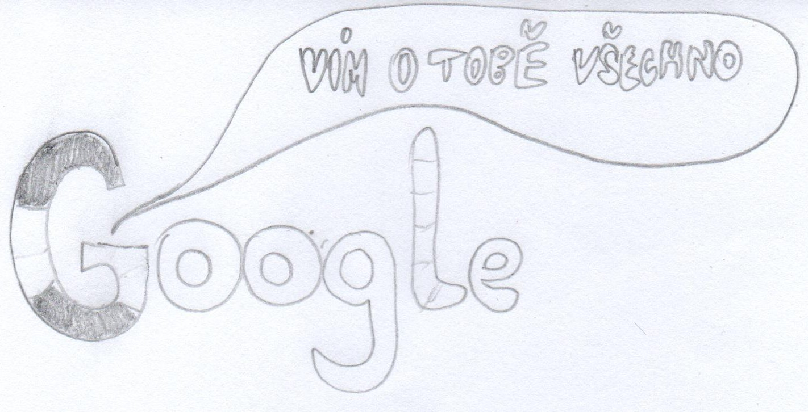
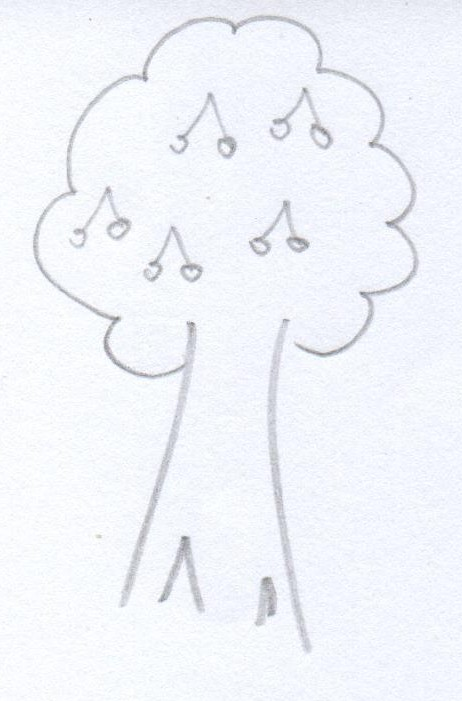
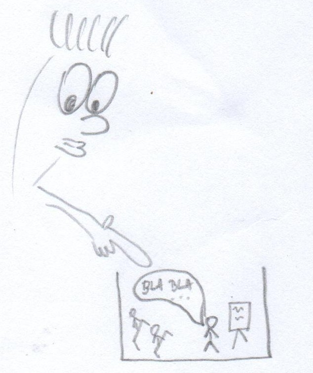

# **Kreativní deník**

* * *

# Šablona

## Tři pozitivní věci a proč mi přišly pěkné?

1. _
2. _
3. _

## Co a proč mě dnes překvapilo

...že ještě žiju.

## Myšlenková mapa dne

*Můžete shrnout oblasti činnosti, ale také zahrnout myšlenky, pocity, dát si zpětnou vazbu, hledat poučení; dívat se na to, jak by šla určitá činnost dne udělat jinak.*

## Co zajímavého jsem dnes přečetl?

Nic? :D

## Popis náhodného předmětu:

*5 minut, k čemu by ta věc mola být dobrá?*

## Kreativní nástroj dne:

*název a použití*

## Zajímavost dne: > _ <

*proč se mi to zdá neobvyklé a čím se to od jiných událostí liší?*

## Dnešní problém s kreativitou

*proč se to stalo a kdy?*

## Umělecké utrpení

*Náhodná kresba:* 

*Zajímavá věc dne:* 

*Zajímavá věc dne s představivostí* 

* * *

# 1. Den (13.5.2018)

## Tři pozitivní věci a proč mi přišly pěkné?

1. Projížďka autem po přírodě. Bylo pěkné počasí a tráva krásně zelená, navíc ten čerstvá vzduch - nádhera.
2. Vytrhal jsem plevel na zahrádce. Kromě toho, že bylo hezky a zvelebil jsem si kousek zahrady jsem se navíc i uklidnil a odstresoval.
3. Večerní grilovačka. Bylo to fajn zakončení dne. Dokonce jsem byl tak fancy, že jsem obracel maso hůlkama :D

## Co a proč mě dnes překvapilo

Dnes jsem překvapil sám sebe protože jsem se včas zvládl připravit na den matek. Neuvěřitelné, asi stárnu.

## Myšlenková mapa dne

## Co zajímavého jsem dnes přečetl?

Přečetl jsem si zajímavý [článek o Google Assistant](https://www.cnews.cz/google-assistant-cestina-io18), podle kterého by jsme se v Česku mohli dočkat lokalizované mutace. Což je super, konečně na svůj telefon nebudu muset hulákat anglicky, bude mi rozumět česky. A jednoho krásného dne, až nebudu brát žádné ohledy na moje soukromí si pořídím i Google Home.

## Popis náhodného předmětu: *Počítačová myš*

Počítačová myš je úžasné zařízení, bez kterého si nedovedu představit jediný den. Jako první se nabízí použití jako nástroje pro ovládání kurzoru na obrazovce počítače. V práci mám myš s programovatelnými tlačítky, takže je mnohem snadnější používat všemi milovanou funkci kopírovat-vložit. K čemu dalšímu by se dala myš použít? Vždycky s ní můžete někoho praštit. Když myš "umře", tak se dá použít jako těžítko. Drátek by šel v krajní nouzi použít jako tkanička do bot (musel by to být hodně dlouhý drátek, já vím). Z bezdrátové myši by šly použít baterie, pokud by nebyly samozřejmě vybité. Konec konců se myš dá rozebrat a vytřídit na plast a elektroniku. Šikovní domácí kutilové by s obsaženými obvody a laserem určitě dokázaly divy.

## Kreativní nástroj dne: Visual Studio Code

[Visual Studio Code](https://code.visualstudio.com/) je velice modulární nástroj primárně určený k psaní zdrojových kódů. Nicméně je v této aplikaci možné psát dokumenty v Markdownu a potom je i exportovat do PDF. Vyhovuje mi především nerušivým prostředím a tím jak se ovládá. Osobně tuhle aplikaci považuji za to nejlepší, co kdy z Microsoftu vypadlo.

## Zajímavost dne: Píšu deník... včas!

*"Today is a special day!"* - Těmito slovy začínalo nejedno ráno letních táborů, na které jsem jako mladší jezdil. A čím byl dnešní den speciální? Především tím, že jsem se dostal k tvorbě kreativního deníku dřív jak tři dny před odevzdáním. To na moje skromné poměry považuji za velkolepý úspěch.

## Dnešní problém s kreativitou

Menší problém s kreativitou nastal, když jsem přemýšlel jakou formou tvořit tento deník. Psaní na papír by bylo pohodlnější, ale výsledek by pravděpodobně nebyl čitelný a jak se znám, tak bych ho byl schopný ztratit mezi dalšími papíry.

Nakonec jsem se rozhodl pro psaní deníku na počítači pomocí značkovacího jazyka Markdown, který je dost jednoduchý, funkční a intuitivní aby mě neomezoval. Navíc jsem si mohl vytvořit šablonu, takže každý den ušetřím pár chvil psaní do počítače.

## Umělecké utrpení

*Náhodná kresba:* 

*Zajímavá věc dne:* 

*Zajímavá věc dne s představivostí* 

# 2. Den (15.5.2018)

## Tři pozitivní věci a proč mi přišly pěkné?

1. V práci se mi konečně povedlo převést MySQL 4.0 databázi na MariaDB 5.5 a ještě jsem u ní změnil kódování na UTF-8. Je to super, protože už mě začínal tlačit čas a v dnešní době už taky není úplně OK pracovat s kódováním Windows1250.
2. Konečně zapršelo, takže na zahradě není takové sucho a pročistil se vzduch - co víc si přát? :)
3. Google Assistant se se mnou opět baví a co víc? Změnil i hlas. Poslední dva dny měl můj telefon nějakou krizi a nefungoval Google Assistant, což nebylo úplně příjemné. Každopádně dnes už funguje, takže teď zkouším i [nově představené hlasy](https://www.theverge.com/2018/5/8/17332014/google-assistant-voice-john-legend).

## Co a proč mě dnes překvapilo

Cestou domů jsem se pohledem zarazil o venkovní klimatizaci na benzínce, kolem které chodím každý den už několik let. Teprve dnes jsem si ale uvědomil, že tam taková věc je. Překvapil mě i název výrobce *Sinclair*, což mi okamžitě evokovalo prehistorický počítač *ZX Spectrum* od stejnojmenné společnosti (ačkoliv původní *Sinclair* už neexistuje).

## Myšlenková mapa dne

## Co zajímavého jsem dnes přečetl?

Asi nejzajímavější článek, který mi dnes Google byl o možné [výchozí integraci notifikací a dalších funkcí z Android zařízení do příštího vydání Ubuntu 18.10](https://www.omgubuntu.co.uk/2018/05/ubuntu-18-10-gsconnect-extension-by-default). V podstatě by byl jen předinstalovaný balíček gsconnect, což není ani dnes nic nemožného. Nicméně i tak se jedná o příjemnou zprávičku, která, pokud se naplní, bude mít jedině pozitivní ohlasy.

## Popis náhodného předmětu: *Sklenice*

Sklenice na vodu je běžný předmět denní potřeby, který známe všichni. Jenže jak taková sklenice vypadá? Pokaždé jinak a často nemusí být ani ze skla. Třeba sklenice, kterou mám před sebou je úzká a vysoká, ve spodní části má modrý pruh, ale jinak je čirá. Další sklenice, kterou máme doma je zelená, široká a nízká. Všechny sklenice slouží pro uchování tekutin, běžně určených k vypití, ale někdy se dají použít jen jako velmi nepřesné odměrky, čehož jistě využívají zkušení kuchaři pracující ověřeným způsobem "by voko". Lidé se slabším dechem by sklenici jistě mohli využít k zhasnutí svíčky nebo uhašení miniaturního požáru.

## Kreativní nástroj dne: GitHub

[GitHub](github.com) je nástroj určený pro uchovávání a verzování zdrojových kódů aplikací. Jeho hlavním přínosem je možnost snadné a efektivní spolupráce vícero lidí na jednom projektu.

GitHub používám jako bezpečné úložiště pro tento kreativní deník. Navíc do deníku můžu kdykoliv doplňovat obsah, třeba i cestou vlakem z telefonu a ihned vidím výsledek mých úprav.

## Zajímavost dne: nebezpečí tlačítka 'Odpovědět všem'

S emaily přicházím do styku každý den, spoustu jich přečtu a na některé odpovím. Docela běžný stav... alespoň do okamžiku, kdy jsme nevědomky klepl na 'Odpovědět všem' místo 'Odpovědět *někomu*' a moje soukromá odpověď se rozeslala při nejmenším mezi dalších 50 lidí. Běžně si takové věci hlídám, ale dneska jsem byl zjevně dost unavený abych takovou drobnost přehlédl.

## Dnešní problém s kreativitou

Podobně jako minule se moje kreativní krize projevila při psaní kreativního deníku. Dnes jsem měl problém s kreslením - tohle mi nikdy opravdu nešlo.

## Umělecké utrpení

*Náhodná kresba:* 

*Zajímavá věc dne:* 

*Zajímavá věc dne s představivostí* 

# 3. Den (17.5.2018)

## Tři pozitivní věci a proč mi přišly pěkné?

1. Povedl se mi skvělý začátek zkouškového. První zkoušku jsem měl rychle za sebou a ještě rychleji opravenou, dostal jsem A. Co víc si přát. :)
2. Po dlouhé době jsem měl možnost (spíš povinnost) prezentovat před větším počtem lidí a nedopadlo to nejhůř. Ze začátku jsem byl docela nervózní, ale ustál jsem to. Zpětně mě povzbudil spolužák, který mi prezentaci pochválil, ale nutno říct, že se mnou prezentovali další dva lidi.
3. Po škole jsem si udělal příjemné odpoledne. S přítelkyní jsme si dali burger na pivních sadech a večer jsem ještě zašel s kamarádem na Avengery. Zkrátka a dobře, tenhle pátek byl nejlepší za poslední půlrok.

## Co a proč mě dnes překvapilo

Sice je to drobnost, ale když jsme na pivních sadech dostali burgery, překvapila mě příloha. Resp. přítelkyně dostala obyčejné hranolky, zatím co já jsem dostal bramborové dolárky (ano, teď jsem si to šel najít). Připadá mi lehce absurdní, že se mezi tím rozlišuje - zvlášť když se v obou případech jedná jen o kus osmažené brambory. Jediný rozdíl je v tvaru a upřímně, hranolky jsou podle mě mnohem praktičtější.

## Myšlenková mapa dne

## Co zajímavého jsem dnes přečetl?

Dnes byl poměrně nabitý den, takže jsem zvládl jen pár zpráviček na [root.cz](root.cz). Tou nejzajímavější je zprávička o poměrně výrazné [změně v chování prohlížeče Google Chrome](https://www.root.cz/zpravicky/chrome-postupne-odstrani-zamecek-pro-https-v-adrese/). Stručně řečeno, Chrome už nebude uživatelům dávat najevo, že jsou na zabezpečené stránce (přistupují přes HTTPS), varovat bude jen při práci s weby bez HTTPS. [\[Podrobněji zde\]](https://www.bleepingcomputer.com/news/software/google-chrome-to-remove-secure-indicator-from-https-pages-in-september/)

## Popis náhodného předmětu: *Strom*

Strom je živý organismus, jehož hlavním přínosem je tvorba kyslíku, díky kterému může na naší planetě existovat život v současné podobě. Nedělá to snad proto, že by měl ostatní formy života tak rád, dělá to jen kvůli sobě, protože je to pro něj výhodné. Kyslík je pro strom z určitého hlediska vlastně odpadní produkt. Kromě toho dávají stromy stín a některé mají, i pro lidi, poživatelné plody, takže slouží jako zdroj potravy. Každý věští strom lze využít jako zdroj dřeva pro další zpracování - se dřevem jde dělat spousta věcí, ale to už je jiné povídání. Stromy často slouží i jako domov pro mnoho tvorů, každého snad napadnou ptáci, veverky nebo nejrůznější červi a určité i nespočitatelné množství druhů bakterií.

## Kreativní nástroj dne: MINDMUP

[MINDMUP](https://www.mindmup.com/) je online nástroj pro tvorbu myšlenkových map. Je volně dostupný a mapy je možné tvořit i bez registrace. Je možný export do několika formátů, osobně využívám [png](https://cs.wikipedia.org/wiki/Portable_Network_Graphics) s průhledným pozadím. Na aplikaci jsem narazil díky předmětu [KPI11](https://is.muni.cz/predmet/phil/podzim2017/KPI11) kde byl zmíněn a pro moje potřeby mi ze všech vyhovuje nejvíce.

## Zajímavost dne: Kino a ujetý vlak

O kině jsem se už zmiňoval, ale co se dělo po něm taky nebylo úplně obvyklé. Normálně si totiž dávám pozor aby mi neujel poslední vlak domů, jenže kino se trochu protáhlo a vlak kterým jsem chtěl jel byl beznadějně pryč. Další jel za hodinu a půl a nebo v 5 ráno. Nechtělo se mi čekat a ani zdržovat kamaráda protože už jsme byli oba dva akorát zralí do postele. Naštěstí se sám nabídl jestli u něj nechci přespat, což jsem neodmítl.

## Dnešní problém s kreativitou

Největší problém nastal při výběru předmětu k popisu v rámci tohoto deníku. Problém nakonec vyřešil krátký pohled z okna na zahradu, které dominuje ani nevím jak ringle.

## Umělecké utrpení

*Náhodná kresba:* 

*Zajímavá věc dne:* Poznámky k prezentaci 

*Zajímavá věc dne s představivostí* 

# 4. Den (25.5.2018)

## Tři pozitivní věci a proč mi přišly pěkné?

1. Při nástupu do vlaku mi průvodčí popřál hezký den, což se mi nikdy předtím nestalo. Dost mě to překvapilo a potěšilo, protože už ráno jsem vstával s vědomím, že dnešek bude náročný.
2. Mezi zkouškami jsem si šel na pár hodin odpočinout do práce, kde na mě ještě zbylo Reese's, kolegové byli rádi, že mě vidí a ještě jsem vyfasoval trička kvůli jedné celofiremní šílenosti v létě. Jak s oblibou říkám, *zaměstnanci budou schopni lépe identifikovat po kom mají házet rajčata a koho napichovat na vidle*. Samozřejmě jsem udělal i něco produktivního, byl jsem přece v práci. Celkově to byla příjemně strávená směna - co víc si přát než dobrou práci, která vás baví.
3. Ráno jsem se rozhodl vyzkoušet novou košili a jedny lepší kalhoty - normálně tyhle věci nenosím, ale dnes mi to nepřipadalo jako špatný nápad. K mému překvapení jsem se vůbec necítil špatně a nesvůj.

## Co a proč mě dnes překvapilo: Francouzi měli internet už v 80. letech

V jednom z článků, které jsem si dnes přečetl jsem narazil na systém Minitel, což je francouzský předchůdce internetu (po funkční stránce). Vznikl na počátku 80. let minulého století a poslední slovo řekl až v roce 2012 [\[Zdroj\]](http://www.bbc.com/news/magazine-18610692), což ukazuje na jeho masovou rozšířenost.

Minitel fungoval tak, že kdo chtěl, měl doma nebo v práci přístupový terminál zapojený do telefonní sítě. Terminál se skládal z obrazovky a klávesnice. Informační architektura včetně obsahu byla řízena centrálně a systém byl oproti internetu mnohem uzavřenější.

## Myšlenková mapa dne

## Co zajímavého jsem dnes přečetl?

Přečetl jsem článek *The information strategy of the European Union* od *Lilla Juhász*, který rozebírá vývoj informační politiky a společnosti v EU. Paradoxně nevíc mě na celém článku zaujala zmínka o systému Minitel, který rozebírám výše. Samotný vývoj informační strategie EU už tak zajímavý nebyl, i když bez něj by dnešní Evropa byla někde úplně jinde.

## Popis náhodného předmětu: Květináč

Květináče zcela běžně pro zadržení vody pro květiny. Bývají plastové, keramické a možná i výjimečně i dřevěné. Kromě toho se dá květináč použít i jako miska na vodu, pro domácího mazlíčka, v krajní nouzi i místo talíře pro běžného člověka, mělký květináč by šel použít i jako tác a za zkoušku by stálo ho otestovat i jako fresbee. Větší a hluboký květináč jde použít i jako šnečí farma - to už mám od mala vyzkoušené. Hezčí a menší květináče mohou být použity i jako stojánky na tužky, ty větší zase jako malé odpadkové koše, když na věc přijde. Dokonce i rozbitý květináč není úplně k zahození - úlomky jdou použít jako pseudozátka na dno jiných květináčů, aby z nich nepadala hlína.

## Kreativní nástroj dne: Papír

Ano, i něco tak obyčejného jako je kus prázdného papíru může vést ke kreativitě. Nejlépe se mi na něm dělají návrhy myšlenkových map, které pak natlačím do počítače, kde je můžu pohodlněji upravovat. Fakt je ale ten, že papír mě nijak neomezuje a můžu lépe přemýšlet - nic mě nerozptyluje, což se u počítače říct nedá.

## Zajímavost dne: Už vím jak funguje menza

Do menzy na České moc často nechodím a dřív jsem tam navštěvoval jen VegeBar, ale to bylo ještě na začátku semestru. Dnes jsem rozhodl zajít do normální menzy, kde jsem mě zarazily číselné terminály, ze kterých jsem byl zpočátku trochu nešťastný. Nepodíval jsem se totiž na nabídku jídel, takže jsem se jen nešťastně podíval na paní u okýnka a ukázal na náhodný talíř, který byl vidět ve výloze. Paní otráveně odvětila, že je to jednička a ať si přiložím kartičku. No...tak jsem zmáčkl jedničku a přiložil průkaz studenta... a ono se nic nestalo. Zkusil jsem tedy prvně přiložit kartičku a jedničku zmáčknou až potom - taky nic. Vyšlo to až na třetí pokus, kdy už ani nevím co jsem udělal. Paní kuchařka mi teda dala jídlo a já šel spokojeně ke stolu. Oběd byl dobrý, i když těžko říct co to vlastně bylo. Když jsem dojídal, tak jsem si všiml, že je v jídelně přítomná i pokladna - to jsem docela zpanikařil, protože jsem nevěděl jestli jsem neměl jít ještě k ní, aby mi strhli kredit z karty. Nějak jsem odvodil a doufal, že mi kredit strhli už u výdejního okýnka a nenápadně jsem se vytratil. Když jsem později se podíval stav konta, oddechl jsem si - nejsem zloděj, menza si peníze strhla.

## Dnešní problém s kreativitou

Kupodivu jsem dnes na žádný problém s kreativitou nenarazil.

## Umělecké utrpení

*Náhodná kresba:* 

*Zajímavá věc dne:* 

*Zajímavá věc dne s představivostí* 
