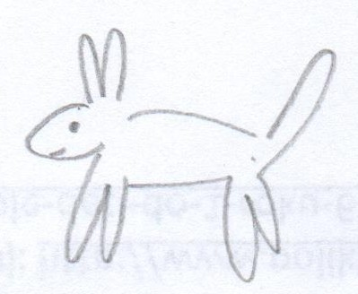
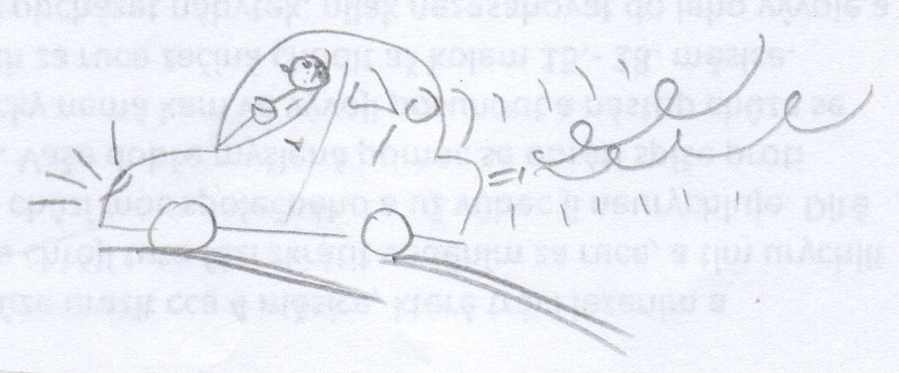

# **Kreativní deník**

# 1. Den (13.5.2018)

## Tři pozitivní věci a proč mi přišly pěkné?

1. Projížďka autem po přírodě. Bylo pěkné počasí a tráva krásně zelená, navíc ten čerstvá vzduch - nádhera.
2. Vytrhal jsem plevel na zahrádce. Kromě toho, že bylo hezky a zvelebil jsem si kousek zahrady jsem se navíc i uklidnil a odstresoval.
3. Večerní grilovačka. Bylo to fajn zakončení dne. Dokonce jsem byl tak fancy, že jsem obracel maso hůlkama :D

## Co a proč mě dnes překvapilo

Dnes jsem překvapil sám sebe protože jsem se včas zvládl připravit na den matek. Neuvěřitelné, asi stárnu.

## Myšlenková mapa dne


## Co zajímavého jsem dnes přečetl?

Přečetl jsem si zajímavý [článek o Google Assistant](https://www.cnews.cz/google-assistant-cestina-io18), podle kterého by jsme se v Česku mohli dočkat lokalizované mutace. Což je super, konečně na svůj telefon nebudu muset hulákat anglicky, bude mi rozumět česky. A jednoho krásného dne, až nebudu brát žádné ohledy na moje soukromí si pořídím i Google Home.

## Popis náhodného předmětu: *Počítačová myš*

Počítačová myš je úžasné zařízení, bez kterého si nedovedu představit jediný den. Jako první se nabízí použití jako nástroje pro ovládání kurzoru na obrazovce počítače. V práci mám myš s programovatelnými tlačítky, takže je mnohem snadnější používat všemi milovanou funkci kopírovat-vložit. K čemu dalšímu by se dala myš použít? Vždycky s ní můžete někoho praštit. Když myš "umře", tak se dá použít jako těžítko. Drátek by šel v krajní nouzi použít jako tkanička do bot (musel by to být hodně dlouhý drátek, já vím). Z bezdrátové myši by šly použít baterie, pokud by nebyly samozřejmě vybité. Konec konců se myš dá rozebrat a vytřídit na plast a elektroniku. Šikovní domácí kutilové by s obsaženými obvody a laserem určitě dokázaly divy.

## Kreativní nástroj dne: Visual Studio Code

[Visual Studio Code](https://code.visualstudio.com/) je velice modulární nástroj primárně určený k psaní zdrojových kódů. Nicméně je v této aplikaci možné psát dokumenty v Markdownu a potom je i exportovat do PDF. Vyhovuje mi především nerušivým prostředím a tím jak se ovládá. Osobně tuhle aplikaci považuji za to nejlepší, co kdy z Microsoftu vypadlo.

## Zajímavost dne: Píšu deník... včas!

*"Today is a special day!"* - Těmito slovy začínalo nejedno ráno letních táborů, na které jsem jako mladší jezdil. A čím byl dnešní den speciální? Především tím, že jsem se dostal k tvorbě kreativního deníku dřív jak tři dny před odevzdáním. To na moje skromné poměry považuji za velkolepý úspěch.

## Dnešní problém s kreativitou

Menší problém s kreativitou nastal, když jsem přemýšlel jakou formou tvořit tento deník. Psaní na papír by bylo pohodlnější, ale výsledek by pravděpodobně nebyl čitelný a jak se znám, tak bych ho byl schopný ztratit mezi dalšími papíry.

Nakonec jsem se rozhodl pro psaní deníku na počítači pomocí značkovacího jazyka Markdown, který je dost jednoduchý, funkční a intuitivní aby mě neomezoval. Navíc jsem si mohl vytvořit šablonu, takže každý den ušetřím pár chvil psaní do počítače.

## Umělecké utrpení

*Náhodná kresba:*<br>


*Zajímavá věc dne:*<br>


*Zajímavá věc dne s představivostí*<br>


# 2. Den (15.5.2018)

## Tři pozitivní věci a proč mi přišly pěkné?

1. V práci se mi konečně povedlo převést MySQL 4.0 databázi na MariaDB 5.5 a ještě jsem u ní změnil kódování na UTF-8. Je to super, protože už mě začínal tlačit čas a v dnešní době už taky není úplně OK pracovat s kódováním Windows1250.
2. Konečně zapršelo, takže na zahradě není takové sucho a pročistil se vzduch - co víc si přát? :)
3. Google Assistant se se mnou opět baví a co víc? Změnil i hlas. Poslední dva dny měl můj telefon nějakou krizi a nefungoval Google Assistant, což nebylo úplně příjemné. Každopádně dnes už funguje, takže teď zkouším i [nově představené hlasy](https://www.theverge.com/2018/5/8/17332014/google-assistant-voice-john-legend).

## Co a proč mě dnes překvapilo

Cestou domů jsem se pohledem zarazil o venkovní klimatizaci na benzínce, kolem které chodím každý den už několik let. Teprve dnes jsem si ale uvědomil, že tam taková věc je. Překvapil mě i název výrobce *Sinclair*, což mi okamžitě evokovalo prehistorický počítač *ZX Spectrum* od stejnojmenné společnosti (ačkoliv původní *Sinclair* už neexistuje).

## Myšlenková mapa dne


## Co zajímavého jsem dnes přečetl?

Asi nejzajímavější článek, který mi dnes Google byl o možné [výchozí integraci notifikací a dalších funkcí z Android zařízení do příštího vydání Ubuntu 18.10](https://www.omgubuntu.co.uk/2018/05/ubuntu-18-10-gsconnect-extension-by-default). V podstatě by byl jen předinstalovaný balíček gsconnect, což není ani dnes nic nemožného. Nicméně i tak se jedná o příjemnou zprávičku, která, pokud se naplní, bude mít jedině pozitivní ohlasy.

## Popis náhodného předmětu: *Sklenice*

Sklenice na vodu je běžný předmět denní potřeby, který známe všichni. Jenže jak taková sklenice vypadá? Pokaždé jinak a často nemusí být ani ze skla. Třeba sklenice, kterou mám před sebou je úzká a vysoká, ve spodní části má modrý pruh, ale jinak je čirá. Další sklenice, kterou máme doma je zelená, široká a nízká. Všechny sklenice slouží pro uchování tekutin, běžně určených k vypití, ale někdy se dají použít jen jako velmi nepřesné odměrky, čehož jistě využívají zkušení kuchaři pracující ověřeným způsobem "by voko". Lidé se slabším dechem by sklenici jistě mohli využít k zhasnutí svíčky nebo uhašení miniaturního požáru.

## Kreativní nástroj dne: GitHub

[GitHub](github.com) je nástroj určený pro uchovávání a verzování zdrojových kódů aplikací. Jeho hlavním přínosem je možnost snadné a efektivní spolupráce vícero lidí na jednom projektu.

GitHub používám jako bezpečné úložiště pro tento kreativní deník. Navíc do deníku můžu kdykoliv doplňovat obsah, třeba i cestou vlakem z telefonu a ihned vidím výsledek mých úprav.

## Zajímavost dne: nebezpečí tlačítka 'Odpovědět všem'

S emaily přicházím do styku každý den, spoustu jich přečtu a na některé odpovím. Docela běžný stav... alespoň do okamžiku, kdy jsme nevědomky klepl na 'Odpovědět všem' místo 'Odpovědět *někomu*' a moje soukromá odpověď se rozeslala při nejmenším mezi dalších 50 lidí. Běžně si takové věci hlídám, ale dneska jsem byl zjevně dost unavený abych takovou drobnost přehlédl.

## Dnešní problém s kreativitou

Podobně jako minule se moje kreativní krize projevila při psaní kreativního deníku. Dnes jsem měl problém s kreslením - tohle mi nikdy opravdu nešlo.

## Umělecké utrpení

*Náhodná kresba:*<br>


*Zajímavá věc dne:*<br>


*Zajímavá věc dne s představivostí*<br>


# 3. Den (17.5.2018)

## Tři pozitivní věci a proč mi přišly pěkné?

1. Povedl se mi skvělý začátek zkouškového. První zkoušku jsem měl rychle za sebou a ještě rychleji opravenou, dostal jsem A. Co víc si přát. :)
2. Po dlouhé době jsem měl možnost (spíš povinnost) prezentovat před větším počtem lidí a nedopadlo to nejhůř. Ze začátku jsem byl docela nervózní, ale ustál jsem to. Zpětně mě povzbudil spolužák, který mi prezentaci pochválil, ale nutno říct, že se mnou prezentovali další dva lidi.
3. Po škole jsem si udělal příjemné odpoledne. S přítelkyní jsme si dali burger na pivních sadech a večer jsem ještě zašel s kamarádem na Avengery. Zkrátka a dobře, tenhle pátek byl nejlepší za poslední půlrok.

## Co a proč mě dnes překvapilo

Sice je to drobnost, ale když jsme na pivních sadech dostali burgery, překvapila mě příloha. Resp. přítelkyně dostala obyčejné hranolky, zatím co já jsem dostal bramborové dolárky (ano, teď jsem si to šel najít). Připadá mi lehce absurdní, že se mezi tím rozlišuje - zvlášť když se v obou případech jedná jen o kus osmažené brambory. Jediný rozdíl je v tvaru a upřímně, hranolky jsou podle mě mnohem praktičtější.

## Myšlenková mapa dne


## Co zajímavého jsem dnes přečetl?

Dnes byl poměrně nabitý den, takže jsem zvládl jen pár zpráviček na [root.cz](root.cz). Tou nejzajímavější je zprávička o poměrně výrazné [změně v chování prohlížeče Google Chrome](https://www.root.cz/zpravicky/chrome-postupne-odstrani-zamecek-pro-https-v-adrese/). Stručně řečeno, Chrome už nebude uživatelům dávat najevo, že jsou na zabezpečené stránce (přistupují přes HTTPS), varovat bude jen při práci s weby bez HTTPS. [\[Podrobněji zde\]](https://www.bleepingcomputer.com/news/software/google-chrome-to-remove-secure-indicator-from-https-pages-in-september/)

## Popis náhodného předmětu: *Strom*

Strom je živý organismus, jehož hlavním přínosem je tvorba kyslíku, díky kterému může na naší planetě existovat život v současné podobě. Nedělá to snad proto, že by měl ostatní formy života tak rád, dělá to jen kvůli sobě, protože je to pro něj výhodné. Kyslík je pro strom z určitého hlediska vlastně odpadní produkt. Kromě toho dávají stromy stín a některé mají, i pro lidi, poživatelné plody, takže slouží jako zdroj potravy. Každý věští strom lze využít jako zdroj dřeva pro další zpracování - se dřevem jde dělat spousta věcí, ale to už je jiné povídání. Stromy často slouží i jako domov pro mnoho tvorů, každého snad napadnou ptáci, veverky nebo nejrůznější červi a určité i nespočitatelné množství druhů bakterií.

## Kreativní nástroj dne: MINDMUP

[MINDMUP](https://www.mindmup.com/) je online nástroj pro tvorbu myšlenkových map. Je volně dostupný a mapy je možné tvořit i bez registrace. Je možný export do několika formátů, osobně využívám [png](https://cs.wikipedia.org/wiki/Portable_Network_Graphics) s průhledným pozadím. Na aplikaci jsem narazil díky předmětu [KPI11](https://is.muni.cz/predmet/phil/podzim2017/KPI11) kde byl zmíněn a pro moje potřeby mi ze všech vyhovuje nejvíce.

## Zajímavost dne: Kino a ujetý vlak

O kině jsem se už zmiňoval, ale co se dělo po něm taky nebylo úplně obvyklé. Normálně si totiž dávám pozor aby mi neujel poslední vlak domů, jenže kino se trochu protáhlo a vlak kterým jsem chtěl jel byl beznadějně pryč. Další jel za hodinu a půl a nebo v 5 ráno. Nechtělo se mi čekat a ani zdržovat kamaráda protože už jsme byli oba dva akorát zralí do postele. Naštěstí se sám nabídl jestli u něj nechci přespat, což jsem neodmítl.

## Dnešní problém s kreativitou

Největší problém nastal při výběru předmětu k popisu v rámci tohoto deníku. Problém nakonec vyřešil krátký pohled z okna na zahradu, které dominuje ani nevím jak ringle.

## Umělecké utrpení

*Náhodná kresba:*<br>


*Zajímavá věc dne:* Poznámky k prezentaci<br>


*Zajímavá věc dne s představivostí*<br>


# 4. Den (25.5.2018)

## Tři pozitivní věci a proč mi přišly pěkné?

1. Při nástupu do vlaku mi průvodčí popřál hezký den, což se mi nikdy předtím nestalo. Dost mě to překvapilo a potěšilo, protože už ráno jsem vstával s vědomím, že dnešek bude náročný.
2. Mezi zkouškami jsem si šel na pár hodin odpočinout do práce, kde na mě ještě zbylo Reese's, kolegové byli rádi, že mě vidí a ještě jsem vyfasoval trička kvůli jedné celofiremní šílenosti v létě. Jak s oblibou říkám, *zaměstnanci budou schopni lépe identifikovat po kom mají házet rajčata a koho napichovat na vidle*. Samozřejmě jsem udělal i něco produktivního, byl jsem přece v práci. Celkově to byla příjemně strávená směna - co víc si přát než dobrou práci, která vás baví.
3. Ráno jsem se rozhodl vyzkoušet novou košili a jedny lepší kalhoty - normálně tyhle věci nenosím, ale dnes mi to nepřipadalo jako špatný nápad. K mému překvapení jsem se vůbec necítil špatně a nesvůj.

## Co a proč mě dnes překvapilo: Francouzi měli internet už v 80. letech

V jednom z článků, které jsem si dnes přečetl jsem narazil na systém Minitel, což je francouzský předchůdce internetu (po funkční stránce). Vznikl na počátku 80. let minulého století a poslední slovo řekl až v roce 2012 [\[Zdroj\]](http://www.bbc.com/news/magazine-18610692), což ukazuje na jeho masovou rozšířenost.

Minitel fungoval tak, že kdo chtěl, měl doma nebo v práci přístupový terminál zapojený do telefonní sítě. Terminál se skládal z obrazovky a klávesnice. Informační architektura včetně obsahu byla řízena centrálně a systém byl oproti internetu mnohem uzavřenější.

## Myšlenková mapa dne


## Co zajímavého jsem dnes přečetl?

Přečetl jsem článek *The information strategy of the European Union* od *Lilla Juhász*, který rozebírá vývoj informační politiky a společnosti v EU. Paradoxně nevíc mě na celém článku zaujala zmínka o systému Minitel, který rozebírám výše. Samotný vývoj informační strategie EU už tak zajímavý nebyl, i když bez něj by dnešní Evropa byla někde úplně jinde.

## Popis náhodného předmětu: Květináč

Květináče zcela běžně pro zadržení vody pro květiny. Bývají plastové, keramické a možná i výjimečně i dřevěné. Kromě toho se dá květináč použít i jako miska na vodu, pro domácího mazlíčka, v krajní nouzi i místo talíře pro běžného člověka, mělký květináč by šel použít i jako tác a za zkoušku by stálo ho otestovat i jako fresbee. Větší a hluboký květináč jde použít i jako šnečí farma - to už mám od mala vyzkoušené. Hezčí a menší květináče mohou být použity i jako stojánky na tužky, ty větší zase jako malé odpadkové koše, když na věc přijde. Dokonce i rozbitý květináč není úplně k zahození - úlomky jdou použít jako pseudozátka na dno jiných květináčů, aby z nich nepadala hlína.

## Kreativní nástroj dne: Papír

Ano, i něco tak obyčejného jako je kus prázdného papíru může vést ke kreativitě. Nejlépe se mi na něm dělají návrhy myšlenkových map, které pak natlačím do počítače, kde je můžu pohodlněji upravovat. Fakt je ale ten, že papír mě nijak neomezuje a můžu lépe přemýšlet - nic mě nerozptyluje, což se u počítače říct nedá.

## Zajímavost dne: Už vím jak funguje menza

Do menzy na České moc často nechodím a dřív jsem tam navštěvoval jen VegeBar, ale to bylo ještě na začátku semestru. Dnes jsem rozhodl zajít do normální menzy, kde jsem mě zarazily číselné terminály, ze kterých jsem byl zpočátku trochu nešťastný. Nepodíval jsem se totiž na nabídku jídel, takže jsem se jen nešťastně podíval na paní u okýnka a ukázal na náhodný talíř, který byl vidět ve výloze. Paní otráveně odvětila, že je to jednička a ať si přiložím kartičku. No...tak jsem zmáčkl jedničku a přiložil průkaz studenta... a ono se nic nestalo. Zkusil jsem tedy prvně přiložit kartičku a jedničku zmáčknou až potom - taky nic. Vyšlo to až na třetí pokus, kdy už ani nevím co jsem udělal. Paní kuchařka mi teda dala jídlo a já šel spokojeně ke stolu. Oběd byl dobrý, i když těžko říct co to vlastně bylo. Když jsem dojídal, tak jsem si všiml, že je v jídelně přítomná i pokladna - to jsem docela zpanikařil, protože jsem nevěděl jestli jsem neměl jít ještě k ní, aby mi strhli kredit z karty. Nějak jsem odvodil a doufal, že mi kredit strhli už u výdejního okýnka a nenápadně jsem se vytratil. Když jsem později se podíval stav konta, oddechl jsem si - nejsem zloděj, menza si peníze strhla.

## Dnešní problém s kreativitou

Kupodivu jsem dnes na žádný problém s kreativitou nenarazil.

## Umělecké utrpení

*Náhodná kresba:*<br>


*Zajímavá věc dne:*<br>


*Zajímavá věc dne s představivostí*<br>


# 5. Den (1.6.2018)

## Tři pozitivní věci a proč mi přišly pěkné?

1. Konečně jsem se dostal do knihovny a začal jsem pracovat na jedné seminárce. Je pěkné, že jsou v MZK tak velké studovny a klid na učení. Asi tam budu chodit častěji.
2. Odpoledne jsme s přítelkyní plánovali zbytek Anglie - mám radost, protože nám vyjde čas na Bodiam castle, který jsem navštívil už hodně dávno a líbilo se mi tam.
3. Večer jsme se podívali na film, resp. dokument, ve kterém vystupovali jedni známí. Dost jsme se zasmáli, bylo to fajn.

## Co a proč mě dnes překvapilo

Při čekání v budově hlavního nádraží mě zaujala poměrně pracná výzdoba zdí a to i dost vysoko. Na to že většina lidí jen tupě projde dál bylo takové práce možná i škoda.

## Myšlenková mapa dne


## Co zajímavého jsem dnes přečetl?

V rámci přípravy na seminárku jsem si přečetl o [CDISP-DM](https://en.wikipedia.org/wiki/Cross-industry_standard_process_for_data_mining), což je sada postupů a procesů, které probíhají během data miningu.

## Popis náhodného předmětu: Nástěnka

Nástěnku si dovede představit asi každý, ale zrovna tak ji každý používá tak trochu k něčemu jinému. Někdo ji opravdu používá k upíchnutí důležitých poznámek, které v průběhu dne, týdne či měsíce s radostí odtrhává nebo je prostě jen plní. Jiní nástěnku používají jako výstavku svých uměleckých děl, které se na ni vlezou. No a pak jsou tu lidé kteří nástěnku buď nemají vůbec nebo ji mají jen jako odkladiště vzpomínek, případně jen jako odkladiště věcí, které by se nehodily na poličku a je dobré je mít na očích. Co se týče alternativnějšího využití nástěnky... menší by šly použít jako obří podtácky. Kreativnější jedinci si z korkových nástěnek můžou udělat hodové umělecké dílo, tím, že do korku vpálí nějaký hezký vzor.

## Kreativní nástroj dne: Google Keep

Google Keep je online nástroj určený k tvorbě jednoduchých poznámek, který čas od času používám. Výhodou je, že poznámky mám po ruce vlastně pořád, protože mám widget na ploše

## Zajímavost dne: České dráhy nejsou až tak hrozné

Ano, ČD mají svoje slabé chvilky (někdy až chvíle), kdy by člověk šel raději pěšky, ale aspoň jedna věc funguje. Na rozdíl od Britských drah si totiž můžeme docela pohodlně kupovat jízdenky online, navíc si je nemusíme tisknout. A taky mobilní aplikace od ČD funguje velice dobře, což se o aplikaci od britských National Rail Enquiries říct nedá. Pro jednou České dráhy nejsou tak špatné.

## Dnešní problém s kreativitou

Jak již tradičně, moje problémy s kreativitou nastávají pokaždé, když musím být kreativní. Tentokrát jsem poměrně dlouho přemýšlel, jaký objekt budu popisovat v rámci tohoto kreativního deníku.

## Umělecké utrpení

*Náhodná kresba:*<br>


*Zajímavá věc dne:*<br>


*Zajímavá věc dne s představivostí*<br>


# 6. Den (6.6.2018)

## Tři pozitivní věci a proč mi přišly pěkné?

1. Hurá! Jsem za polovinou v tomto děsivém paskvilu, který nazývám kreativním deníkem. Takže už nemusím plnit všechny
2. Dnes je jeden z dalších dní, kdy se učím na postupovou zkoušku. Užívám si toho, že doma nikdo není - odpočívám od lidí a vychutnávám si krásné počasí.
3. Večer jsem objevil jsem pár zajímavých písniček, při kterých neusnu a u kterých se mi dobře učí. Uvidím, jak si povedou zítra.

## Co a proč mě dnes překvapilo

Ne úplně příjemným zjištěním bylo, že oproti začátku semestru můj obor opustilo něco mezi 10 a 20 lidmi. To znamená, že nás zbývá už jenom něco kolem 50, což se mi nezdá mnoho. V ISu jsem sice nenašel žádnou oficiální statistiku, ale vycházím z aktivity plnění úkolů na peerblenderu a z počtu lidí, kteří mají až podivně nízké bodové hodnocení v informační vědě (ano, takto vypadá moje prokrastinace - prolézám IS a hledám něco zajímavého).

## Myšlenková mapa dne


## Co zajímavého jsem dnes přečetl?

Na rootu jsem si přečetl zprávičku o tom, že [Microsoft kupuje GitHub](https://www.root.cz/clanky/microsoft-oznamil-koupi-githubu-konkurencni-gitlab-uz-prijima-migranty/), což je portál určený k uchovávání, verzování a sdílení zdrojových kódů. Takhle akvizice vzbudila hodně emocí, dá se říct že i menší paniku. Některé projekty se přesouvají na GitLab, BitBucket a podobné služby. Zajímalo by mě jaká budoucnost čeká na IDE Atom, jehož konkurentem je VSCode (ve kterém píšu i tento kreativní deník). Vlastně má teď Microsoft dva produkty se stejným záměrem i cílovou skupinou.

## Zajímavost dne:

Dnes se v Brně opět konaly ohňostroje Ignis Brunensis, tentokrát na přehradě. Vcelku by se nejednalo až o tak mimořádnou věc, kdyby nebyly slyšet až v Tišnově, který je od přehrady vzdálený asi 13 km vzdušnou čarou. Běžně totiž brněnské ohňostroje u nás slyšet nejdou, ale tentokrát byly asi dobré podmínky pro šíření zvuku na velkou vzdálenost.

## Umělecké utrpení

*Náhodná kresba:*<br>


*Zajímavá věc dne:*<br>


*Zajímavá věc dne s představivostí*<br>


# 7. Den (7.6.2018)

Můj milý deníčku, dnes ráno jsem se po probuzení vydal s moji drahou sestrou a její pididcerou do Brna za babičkou. Bylo krásně slunečno, možná až trochu moc horko a dusno - alespoň ve vlaku bylo trošku na umřití. Pidiprcek byl naštěstí hodný a cestou ani jednou neplakal. K babičce jsme přijeli tak akorát na oběd, měli jsme nudlovou polívku a kuřecí stehno s rýží. Pak jsme si dali bábovku a ještě nějaké drobné sladkosti až jsme se, snad jako vždycky, přejedli - bylo to fajn. Nakonec jsme se šli projít. Sestra se potom s ubrečeným a unaveným prckem vydala za kamarádkou, zatím co já jsem se vydal do knihovny, kde jsem sestře půjčil knihu o odsunu němců z Brna.

## Myšlenková mapa dne


## Myšlenka dne

- *Je jedno co člověk dělá, ale vždycky se u babičky dobře nají. Delší pobyt by však mohl vést k soudkovatění libovolné postavy.*

# 8. den (11.6.2018)

Dnes byl **den D**, dopoledne na mě čekala postupová zkouška. I přesto že jsem se na ni poslední týden dost intenzivně připravoval, jsem měl z dnešního dne velké obavy.
*Co když to nezvládnu?* - Přece jen jeden týden není zrovna moc času na naučení se celé látky z informační vědy 1 & 2, dvou okruhů z [Memexu](https://kiskffmu.github.io/memex/) a rychlý průlet metodami knihovnické práce. *Transformaci data* a *nástroje a možnosti internetu* do tohoto utrpení nezahrnuji, protože s těmito předměty jsem nikdy problém neměl.

Navíc se jednalo o první den, pro který byly vypsané termíny...není tedy překvapením, že nás za celý den přišlo jenom 6.

Přišel jsem o 15 minut dřív a tak trochu dle očekávání jsem nikoho na KISKu nepotkal, na termín se mnou byl přihlášený jenom jeden další člověk, tak jsem si říkal, že za chvíli určitě dojde. No, to jsem se pěkně přepočítal. V 11:10 mi už bylo trochu divné, že tam nebyl ani ten další člověk, ale co hůř. On nebyl k sehnání ani můj zkoušející a seminární místnost, kde měla zkouška probíhat, byla zamčená. Po chvilce vnitřní paniky jsem se smutně podíval na agamu a poklidně se usadil na žlutý gauč pod oknem. Chvíli na to se sám od sebe pustil kávovar - tomu už jsem se musel opravdu smát :D nejen že kolem mě nebylo vidět jediného živáčka, ono na KISKu i straší.

Kávovarovému démonovi tenhle malý kousek asi stačil a když viděl, že už mě víc rozhodit nejde, přivolal zkoušejícího. Pan profesor Lorenz se zjevil ve dveřích přímo naproti mě... pitíčko a sešit jehož obsah jsem už ani nevnímal jsem sklidil do batohu a s nejistým úsměvem, krokem a pocitem o věcech budoucích jsem se vydal vstříc jisté smrti.

Nakonec to nebylo až tak hrozné, vytáhl jsem si téma 7b - information retrieval, čili vyhledávání informací. Vlastně ani nevím, které téma by pro mě bylo lepší nebo horší. Rozhodně jsem nevěděl všechno, ale ani jsem nebyl úplně mimo. Ve výsledku mě nejvíc zachránily naučené (ehm...no a taky vhodně vytipované) osobnosti a milníky, které jsem do sebe tlačil horem spodem poslední tři dny (pamatuje ten sešit, který jsem před chvílí zmiňoval?). Po tomto traumatu jsem se šel uklidnit do menzy na České, kde jsem doplnil vypocené litry tekutin velkou porcí šopského salátu - nejsem vegan, vegetarián a ani vitarián, ale Veggie bar má prostě lepší jídla než menza o patro níž.

Potom jsem se vydal do práce, kde mě skoro ani nepoznali jak jsem tam dlouho nebyl. Naštěstí to byl docela klidný den, ale zato výhled na léto vypadá dost děsivě. Čeká nás totiž migrace domény brněnské pobočky...v 8 lidech - jen pro představu, asi o 200 lidí menší pobočku migrovalo 30 lidí a co víme, tak to byl dost chaos. Holt velký nadnárodní korporát nepředstavitelných rozměrů, špatné rozhodnutí a odskáče to spousta lidí.

Po práci jsem utíkal do restaurace VietPalace kde jsem měl sraz s přítelkyní, její kolegyní a jejím přítelem. Samozřejmě jsem měl menší zpoždění protože jsem podcenil rychlost MHD a ještě mi ujel autobus přímo před nosem. Naštěstí na mě nemuseli čekat dlouho a hned jsme šli dovnitř. Bylo fajn po dlouhé době jíst hůlkama, ale upřímně tento pocit pohody se mnou sdílel asi jen přítel od kolegyně přítelkyně (děsivý popis situace, já vím), protože jak přítelkyně tak i její kolegyně toho okometricky moc nesnědly. Potom jsme se vydali do Lužánek, kde jsme si zahráli petang pro líné a neschopné (nevím jak se to správně jmenuje) a udělali jsme si menší piknik. Byl to moc příjemný večer. Nakonec jsme se vydali každý svým směrem. Spal jsem u přítelkyně, ale ráno bylo příšerný - po dvou týdnech, kdy jsem vstával mezi 9 a 11 jsem najednou vstával před šestou ráno. Holt pracující lid těžkej spánek má.

## Myšlenková mapa dne


# 9. den (12.6.2018)

**EVERYTHING IS BROKEN**

- Tento příběh navazuje na předchozí část.

Chvíli po probuzení jsme se vydali směr Královo Pole, kde jsme si s přítelkyní dali sbohem. Ona šla do práce. zatímco já spěchal na nádraží, kde mi před nosem ujel vlak. Po chvilce jel ale další a já už se těšil na svoji měkoučkou postel. Doma jsem si dal krátký powernap, nasnídal se a šel jsem zasadit slunečnice, které mi dala kolegyně od přítelkyně předchozí den. Bude se totiž vzdávat a chce mít slunečnicovou výzdobu, tak jsem jí nabídl, že jí pár slunečnic klidně vypěstuju z čehož byla nadšená. Jen doufám, že z těch slunečnic nebudou mít prvně radost slepice, které rodiče v neděli pořídili. Ty mrchy ozobou úplně všechno, nemají problém ani s břečťanem a nejvíc jim chutná rebarbora, z čehož nemám úplně radost... ale to je jiný příběh, hned vedle toho kachního, o kterém v tomto kreativním deníku nebyla řeč.

Po krátkém relaxu na zahradě jsem si začal číst další knížku *Zeměplochy*, tentokrát *Dámy a pánové*. Jenže po chvíli na mě začal vrčet telefon - na ZUŠce prý po včerejší bouřce přestal jet internet a že co mají dělat. Nakonec bylo třeba abych se do školy vypravil sám a pokusil jsem se problém vyřešit. No, nevyřešil jsem to. Nebo aspoň ne tak jak bych chtěl. Nechci zde mého hodnotitele/moji hodnotitelku zbytečně zatěžovat technikáliemi. Napíšu tedy jen tolik, že jsem na tom strávil necelé 3 hodiny z čehož dvě jsem nechápavě kroutil hlavou nad tím jak je možný, že nemám ani jednu funkční zálohu nastavení od routeru. Jedna záloha měla špatně nastavený rozsah na DHCP serveru a druhá mě nepustila do konfigurace (ne že bych měl špatné heslo, prostě jsem ani nedostal možnost se přihlásit). V obou případech stejně neprocházela žádná komunikace.

Nakonec jsem si vzal router domů na další zkoumání a zbytek sítě nastavil tak, aby nějak fungoval. Hned několikrát jsem si vzpomněl na článek [Everything is broken](https://medium.com/message/everything-is-broken-81e5f33a24e1), o kterém se často zmiňoval Jan Martínek v prvním semestru a ve druhém semestru jsme si ho (naštěstí) měli přečíst v rámci jedné lekce. Opravdu trefné - všechno je rozbité, a nejvíc problémů nastává když má probíhat komunikace mezi dvěma a vícero počítači. Sedí i to, že by věci sice mohly být lepší, ale každý chce být z práce co nejdřív doma a to se týká i mě...mohl jsem se v síti vrtat klidně další hodinu nebo dvě a problém snad vyřešit, ale po včerejšku jsem nebyl úplně fit a tak jsem šal raději domů.

# 10. den (13.6.2018)

**Pozitivní věc dne:** Dnes je poslední den, kdy si vedu tento deník :).

**Myšlenka dne:** *Jednou ze mě bude knihovník... Oook?!*

Ráno jsem se vydal do MZK abych dorazil seminárku do odborných textů. Sice se mi to nepovedlo, ale už mi chybí jen něco málo přes 1000 znaků, takže jsem v klidu..tohle do pátku zvládnu. Když už jsem se nemohl soustředit a potřeboval jsem pauzu, tak jsem se vydal do menzy na oběd. Bohužel musím smutně odvolat co jsem napsal dřív, opravdu nevím jak menza funguje. Chtěl jsem si dát guláš, který byl ukrytý pod volbou 17, jenže udělátory ve výdejních okýnkách berou vždy jen jednu číslici a víc neumí. Nakonec jsem se dopracoval k tomu, že jsem zašel k paní u pokladny a ta mi vydala lísteček, na ten už mi guláš paní kuchařka vydala.

Takto posilněný jsem se vydal do Knihovny na Křižovatce (dále jen křižovatka), kde se běžně starám aby fungovaly počítače a podobné srandy. Tentokrát jsem se však šel zaučit do role plnokrevného knihovníka. Příští týden totiž křižovatka prodělá menší personální krizi a za pultíkem bude potřeba každá ruka. Byla to docela sranda a naštěstí nechodilo moc lidí. Prvně jsem se naučil vracení knížek, spokojeně jsem si pípal knížky do Kohy. Pak jsem si zkoušel rekatalogizaci, kterou knihovníkům na křižovatce opravdu nezávidím a přemýšlím, že když budu mít volný víkend, tak si to zkusím trošku zautomatizovat. Přece jen má Koha zabudovanou SQL konzoly a v tom by byl čert kdyby to nešlo zjednodušit. Poslední vtipnou věc, kterou jsem se naučil bylo samotné půjčování knížek, které není vůbec složité, jen jsem trochu bojoval s razítky a papírovými čtenářskými průkazy. V šest hodin jsem ještě přepočítal kasu a hurá domů.

Nakonec mě ještě napadá, že bych pro zajímavost mohl uvést adresářovou strukturu složky, ve který bydlí tento kreativní deník.
<br><br><br><br><br>
```
.
|- den[1-10]
|  |- mapa.png
|  |- maluvka.jpg
|  |- zv.jpg
|  |- zvsp.jpg
|
|- Kreativní deník.md
|- Kreativní deník.pdf
```

| Název souboru | Účel |
|---------------|------|
| mapa.png      | Myšlenková mapa |
| maluvka.jpg   | Sken náhodné malůvky |
| zv.jpg        | Sken nákresu věci, která mi ten den připadla zajímavá |
| zvsp.jpg      | To samé jako v předchozím bodě, jen s využitím *představivosti* |

## Kytička na rozloučenou
